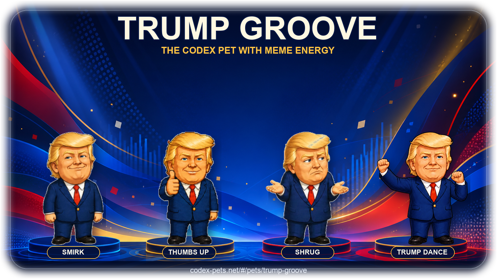

<p align="center">
  
</p>

<h1 align="center">Trump Groove</h1>

<p align="center">
  <strong>A high-energy Codex Pet with expressive reactions and meme energy</strong><br/>
  Expressive poses · Codex Pet V2 · Hypnotic six-beat Trump Dance
</p>

<p align="center">
  English | <a href="README.zh-CN.md">简体中文</a>
</p>

<p align="center">
  <a href="#highlights">Highlights</a> •
  <a href="#install">Install</a> •
  <a href="#repository-layout">Repository Layout</a>
</p>

<p align="center">
  <a href="https://codex-pets.net/#/pets/trump-groove"><strong>View Trump Groove on Codex Pets →</strong></a>
</p>

---

## 🌟 Special Thanks

<p align="center">
  <a href="https://linux.do">
    
  </a>
</p>
<p align="center"><b>For all things AI, head to LINUX DO! Wishing the community ever greater success~</b></p>

---

## Highlights

- **Signature Trump Dance** — a hand-tuned arm-folding groove used as the active `running` animation.
- **Expressive personality** — smirk, thumbs-up, shrug, review, waiting, success/failure, and directional movement states.
- **Codex Pet V2 ready** — `spriteVersionNumber: 2` with a `1536 × 2288` RGBA WebP atlas.
- **Complete animation set** — nine standard Codex states plus sixteen clockwise look directions.
- **Pet-size readability** — smooth transparent edges, compact silhouette, and bold colors designed to remain legible at small sizes.

## Install

### Option 1 — Ask Codex to install it (Recommended)

Open Codex and enter:

```text
Install this pet: npx codex-pets add trump-groove
```

Codex will run the installer and install Trump Groove for you.

### Option 2 — Clone the repository and ask Codex

Clone this repository:

```bash
git clone https://github.com/tomczhang/trump-groove-codex-pet.git
cd trump-groove-codex-pet
```

Then open the cloned repository in Codex and ask:

```text
Install the Trump Groove pet from this repository.
```

SSH users can instead clone with `git@github.com:tomczhang/trump-groove-codex-pet.git`.

> [!IMPORTANT]
> Restart Codex after installation. Trump Groove will only take effect after Codex restarts.

## Repository Layout

```text
.
├── README.md                   # English documentation
├── README.zh-CN.md             # Simplified Chinese documentation
├── pet.json                    # Pet identity and V2 metadata
├── spritesheet.webp            # 8 × 11 Codex Pet V2 animation atlas
├── assets/
│   ├── trump-groove-promo.png  # README promotional artwork
│   ├── trump-dance.gif         # Running-state dance preview source
│   └── emotes/                 # Source poses used in the promo artwork
└── scripts/
    └── build_promo.py          # Deterministic promo compositor
```

## Disclaimer

This is an unofficial, fan-made caricature Pet created for playful and parody use. It is not affiliated with or endorsed by Donald Trump, OpenAI, or the Codex Pets website.
